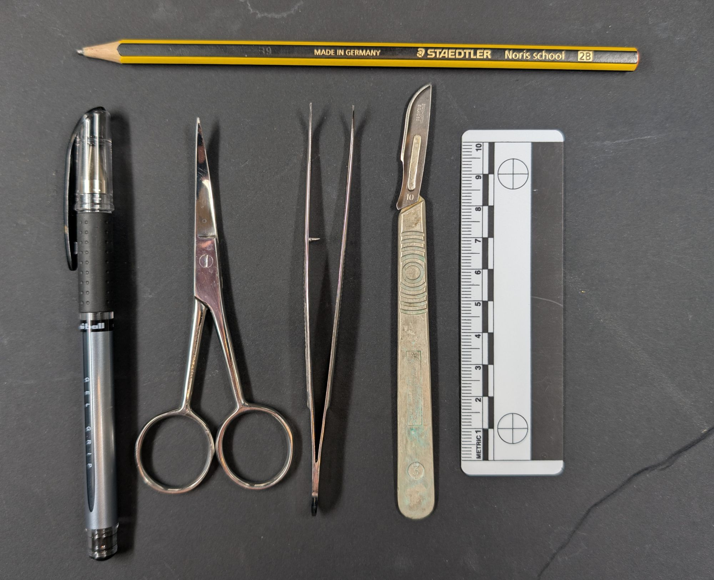
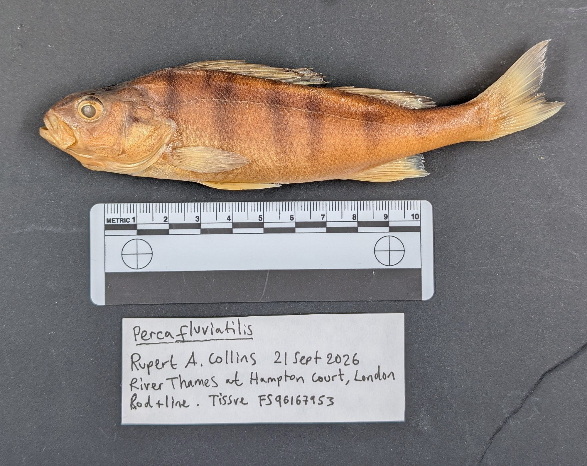
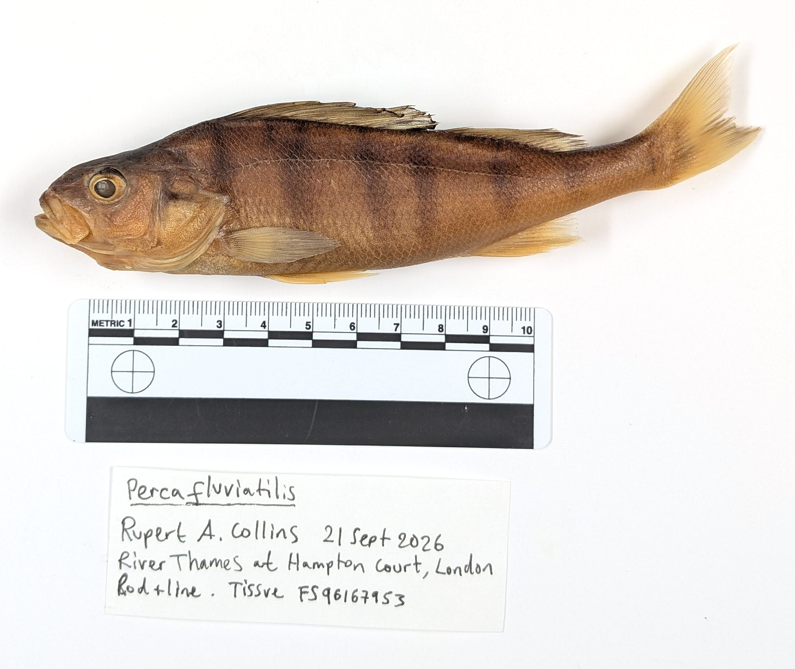

# Fish Tissue Sampling in the Field

A short SOP for fish tissue sampling in the field.

Rupert A. Collins // Natural History Museum, London // September 2026 

### Important notes

This SOP is 

### Kit required

A minimal sampling kit will include:

* DNA tissue sample tubes with unique codes

<figure>
  <figcaption><strong>Figure 1:</strong> Kit required.</figcaption>

</figure>

### Preparing the fish

For best quality DNA samples, the fish should be tissue sampled immediately, or as close as possible, after being collected and euthanised. This is the biggest factor in obtaining good results, as decomposition will quickly degrade DNA. Before sampling, the fish should first be washed in tap/sea/river water to remove debris, excess slime, and any contaminating DNA from other species it may have been in contact with in the net. Fish that are intended to be returned alive can be fin-clipped, taking a small fin sample to avoid permanent damage.

### Photography

It is very important to take good photographs for identification, and especially so if the voucher specimen is not to be retained. It is important to include a scale bar such as a ruler, as well as a written note of the sample details, including the "what, where, who, when" information, and most importantly the DNA sample tube unique code that is written on the side of the tube. Due to lighting, fish colouration and camera settings, it is advisable to have on hand both a light (Fig. 2) and a dark (Fig. 3) coloured plain background. Very small fishes under ~5 cm, such as gobies, are better photographed under water in a small tray, tub or photography aquarium. 

* Species scientific name
* Collector(s)
* Date collected
* Method of collection
* Location, including GPS coordinates if possible
* DNA sample tube unique code

Fish should always be photographed on the left-hand side, facing left. The fish's left-hand side is relative to its normal orientation with its head pointing away from you.   

<figure>
  <figcaption><strong>Figure 2:</strong> Image of perch on dark background.</figcaption>

</figure>

<figure>

<figcaption><strong>Figure 3:</strong> Image of perch on light background.</figcaption>
</figure>
