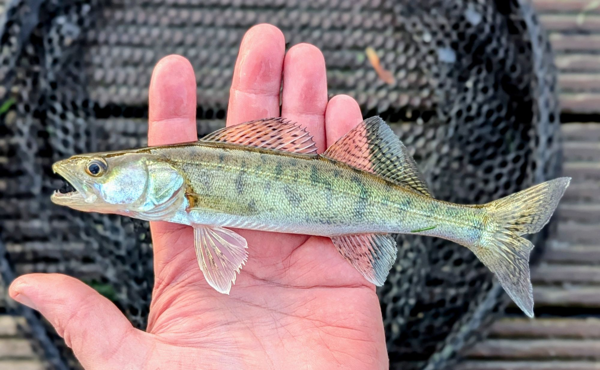
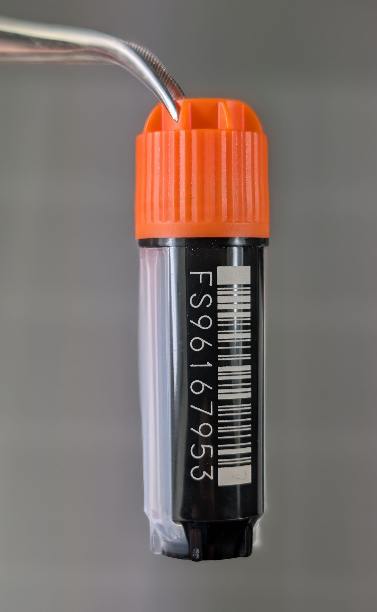
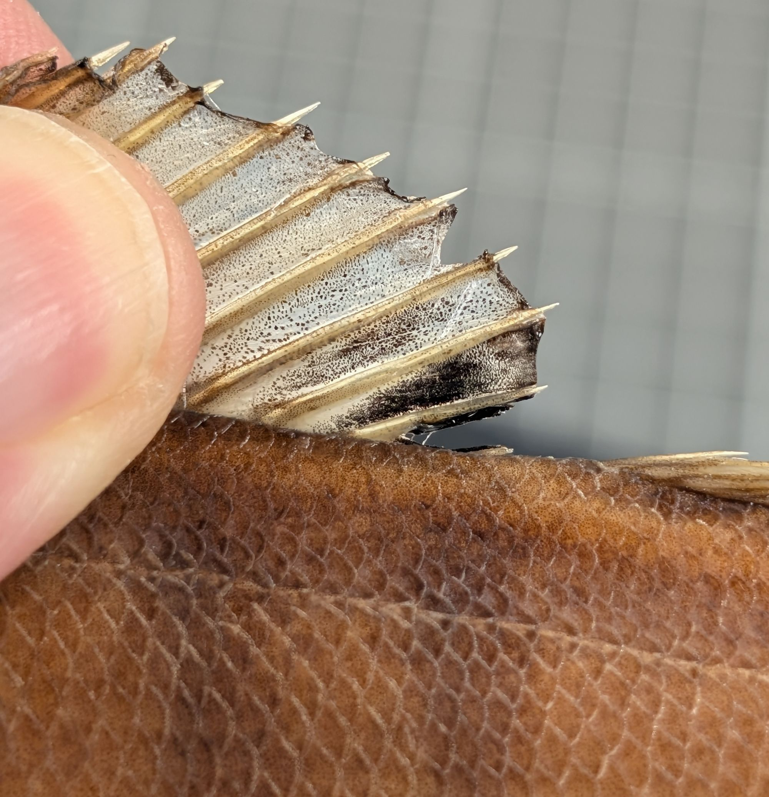
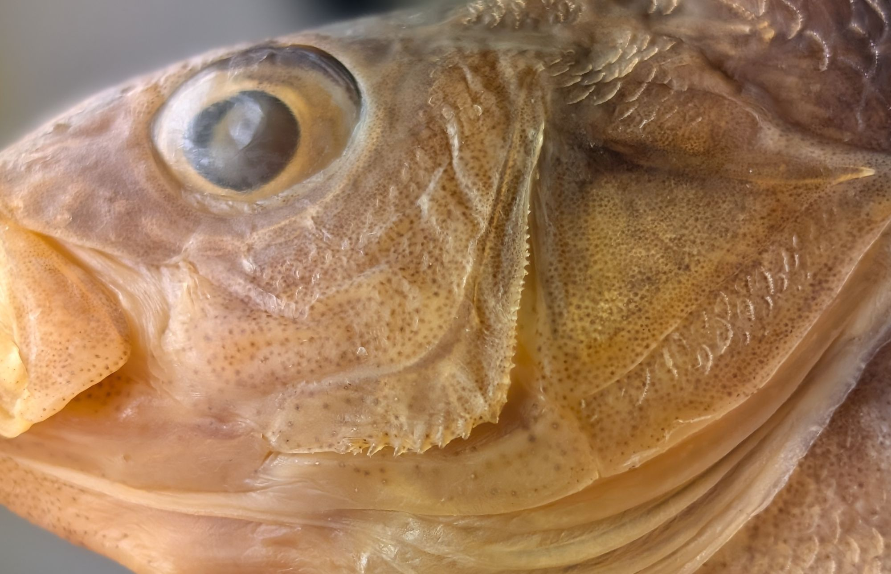
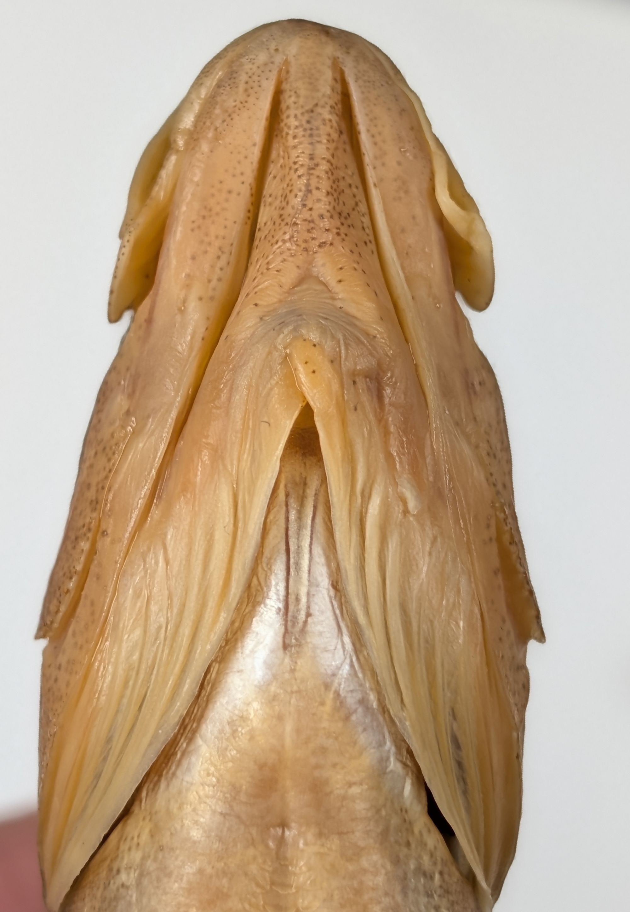
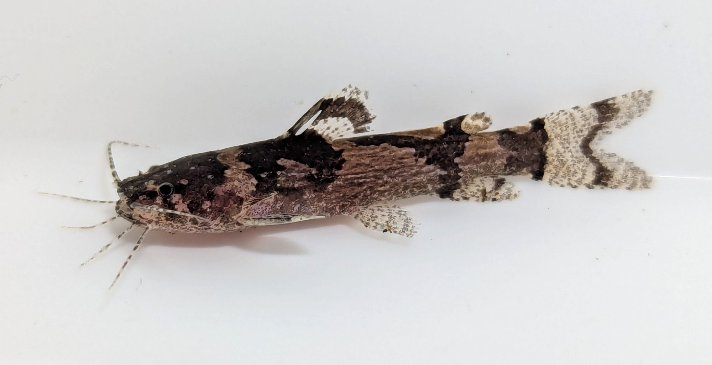
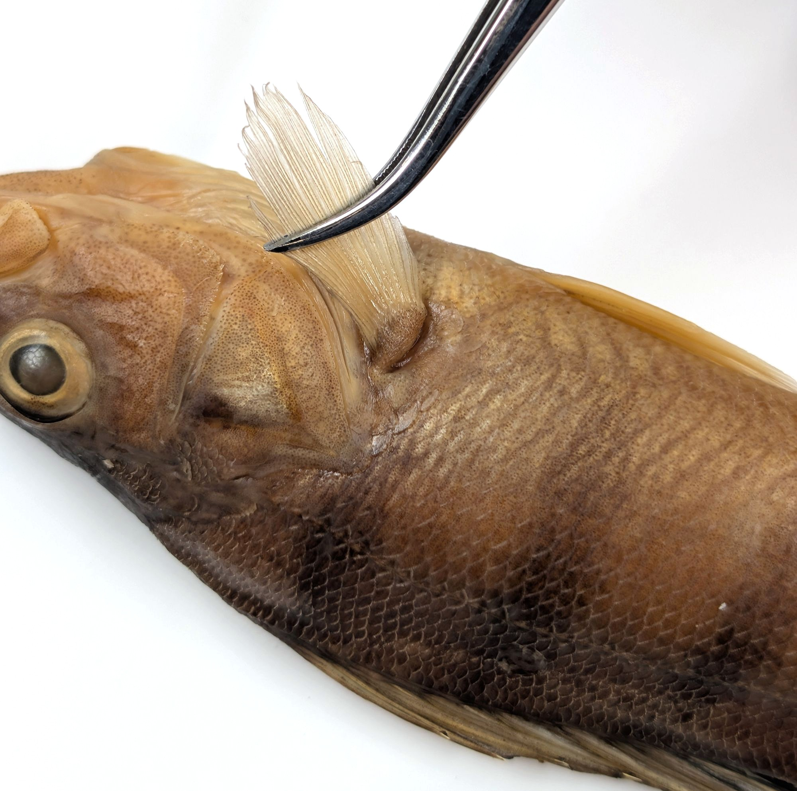
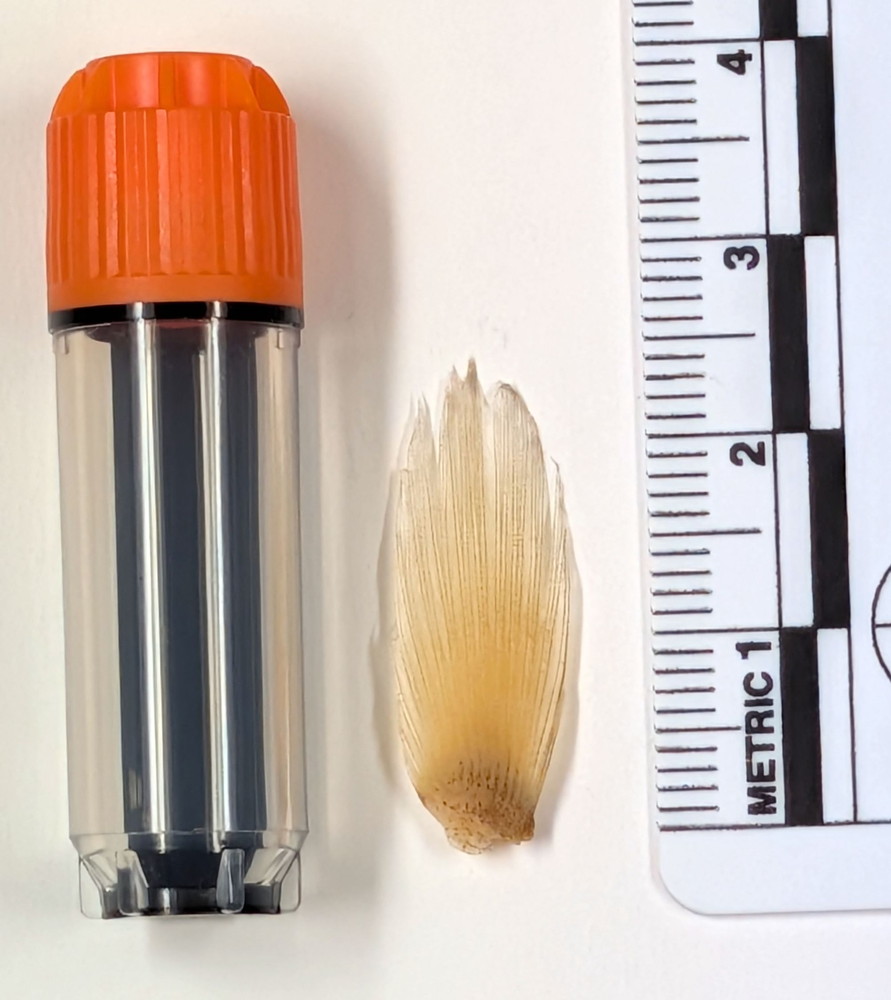
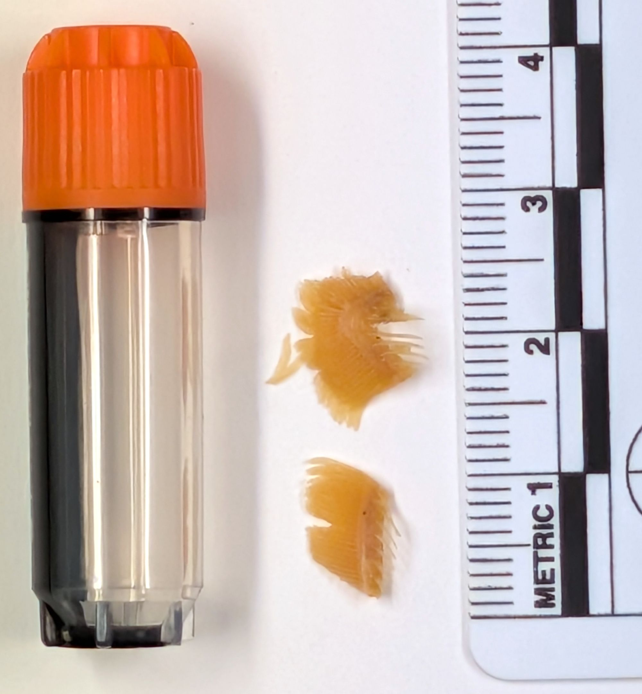
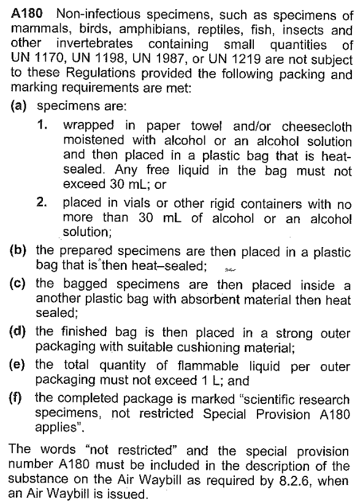

# Fish Tissue Sampling in the Field

#### A short SOP for fish tissue sampling in the field for DNA barcoding and mitogenomics

Rupert A. Collins || Natural History Museum || September 2026 

<figure>

</figure>

### Important note

This SOP is provided as best practice. In real situations with limited resources, it may not be possible to follow exactly. Where possible, I have shown where shortcuts can and can't be taken.

### Kit required

An ideal sampling kit will include:

* DNA tissue sample tubes with unique codes, e.g. the 1.9 mL FluidX cryotubes shown in Fig. 1.
* Absolute (or >95%) ethanol
* Gel ink ballpoint pen (do not use biros near alcohol) 
* Pencil (essential backup)
* Labelling paper, e.g. Resistall paper or similar
* Scalpel and disposable blades
* Sharp dissection scissors
* Fine forceps
* Scale bar, e.g. ruler
* Trays with light and dark backgrounds
* Plastic ziplock or Whirl-pak bags for voucher specimens
* Camera (a good phone camera is adequate, but DSLR better)
* GPS (again phone may suffice)
* 5% bleach solution (household bleach mixed at around 1 part bleach to 19 parts water) or mild dish soap solution 
* Clean water (tap or bottled drinking)
* Paper towels
* Clove oil, benzocaine or MS-222 for fish euthanasia
* PPE when working with chemicals, e.g. disposable gloves and eye protection

<figure>
<figcaption><strong>Figure 1:</strong> A 1.9 mL FluidX cryotube with unique barcode.</figcaption>

</figure>

<figure>
<figcaption><strong>Figure 2:</strong> Kit required for taking tissue samples.</figcaption>

</figure>

### Preparing the fish

For best quality DNA samples, the fish should be tissue sampled immediately, or as soon as possible, after being collected and euthanised. This is the biggest factor in obtaining good results, as any decomposition will quickly degrade DNA. Before sampling, the fish should first be cleaned in tap/bottled/sea/river water to remove debris, excess slime, and any contaminating DNA from other species it may have been in contact with in the net. Fish that are intended to be returned alive can be fin-clipped, taking as small a fin sample as possible to avoid permanent damage. If it is not possible to tissue sample immediately, the fish can be frozen or put on ice until is convenient to sample. Avoid too many freeze-thaw cycles as this will affect DNA quality.

### Photography

It is very important to take good photographs for identification, and especially so if the voucher specimen is not to be retained. Try to photograph the fish as soon as possible after collection in the field, as colouration can be affected by freezing. It is important to include a scale bar such as a ruler, as well as the written note of the sampling details, including the "what, where, who, when" information, and most importantly, the DNA sample tube unique code (written on the side of the tube). Due to lighting, fish colouration and camera settings, it is advisable to have on hand both a light coloured (Fig. 3) and a dark coloured (Fig. 4) plain background. Record the following data on the specimen note:

* Species scientific name
* Collector(s)
* Date collected
* Method of collection
* Location, including GPS coordinates if possible
* DNA sample tube unique code (this is the code that associates the voucher specimen with the DNA sample); write down all tube codes for multiple tissue samples

Fish should always be photographed on their LEFT-hand side, facing left (Fig. 3-4). The fish's left-hand side is relative to its normal horizontal orientation with its head pointing away from you. If the left side is damaged or atypical, photograph the right side. Take closeup shots of key identification features (Fig. 5-7). 

<figure>
 <figcaption><strong>Figure 3:</strong> Image of perch on dark background.</figcaption>

</figure>

<figure>
<figcaption><strong>Figure 4:</strong> Image of perch on light background.</figcaption>

</figure>

<figure>
<figcaption><strong>Figure 5:</strong> Closeup of dorsal fin colouration.</figcaption>

</figure>

<figure>
<figcaption><strong>Figure 6:</strong> Closeup of operculum.</figcaption>

</figure>

<figure>
<figcaption><strong>Figure 7:</strong> Closeup of head ventrally.</figcaption>

</figure>

Very small fishes under ~5 cm, such as gobies, are better photographed after euthanasia under shallow water in a small tilted tray, Tupperware, margarine tub or dedicated photography aquarium (Fig. 8).

<figure>
<figcaption><strong>Figure 8:</strong> Small catfish around 3 cm photographed in tilted shallow tray under water.</figcaption>

</figure>

### Tissue sampling

Any dissection of the fish should take place after photography, on the RIGHT-hand side of the fish (i.e. the other side to that photographed). Good targets for tissue sampling are symmetrical structures such as the pectoral fins, pelvic fins and gill arches. To sample the right-side pectoral fin, hold the fin with forceps and cut at the base with the scalpel or scissors (Fig. 9), removing a small amount of the muscle at the base, which will be rich in DNA (Fig. 10). It is VERY IMPORTANT to not take too big a sample. If too much tissue is crammed into the tube, the ethanol will not penetrate, the concentration will drop and DNA will degrade. If in doubt, take less than you think. If a specimen is particularly rare or valuable, better to take multiple smaller samples in multiple tubes than one big one (record all tube codes associated with the voucher specimen). A small plug of flesh can be cut from the lateral muscle on the right-hand side, but avoid the breaking the gut (contamination). Very small fishes can be placed whole into the tube, but it is important to change the ethanol with fresh the next day. If the fish has been frozen first, take the tissue samples as soon as the fish is sufficiently pliable, to reduce any DNA degradation after thawing.

<figure>
<figcaption><strong>Figure 9:</strong> Sampling the pectoral fin. A larger fish with a thicker fin would require just a sliver rather than the whole fin. </figcaption>

</figure>

<figure>
<figcaption><strong>Figure 10:</strong> Size of sampled pectoral fin. This will yield enough tissue for several DNA extractions.</figcaption>

</figure>

<figure>
<figcaption><strong>Figure 11:</strong> Sampling the gill arches. This will yield enough tissue for several DNA extractions.</figcaption>

</figure>

### Equipment decontamination

It is best practice to clean and decontaminate the dissection equipment between samples, to prevent exogenous DNA contamination from other individuals/species. Ideally this is done with rinsing in a weak (5%) bleach or soap solution, and wiping thoroughly with paper towel, and then rinsing thoroughly with clean water (e.g. tap or bottled drinking water) and/or alcohol. If this is not possible, clean and rinse as best you can between samples with paper towel and water.

### Sample storage and shipping

Best practice is to allow the ethanol and sample to equilibrate for 48 h at room temperature before putting the tube in a -20C freezer or refrigerator. If freezing or refrigeration is not available, the best place is somewhere cool and dark. Follow the IATA A180 guidelines for safe shipping of preserved biological specimens in alcohol (Fig. 12). Alternatively, the ethanol can be carefully poured off before shipping and the tube resealed to avoid issues with dangerous goods. The tissue samples will be fine if they have been fixed for at least a week in the ethanol beforehand.

<figure>
<figcaption><strong>Figure 12:</strong> IATA A180 guidelines for shipping preserved biological specimens.</figcaption>

</figure>

### Voucher specimens

Ideally a voucher specimen will accompany the tissue sample. These are best fixed for ~7 days in a 5-10% formalin solution (after tissue sampling as formalin destroys DNA). If formalin is not available, the fish can be placed in a plastic ziplock or Whirl-Pak bag and carefully frozen at -20C together with its collection information label. Remember to include the tissue tube code(s) (Fig. 1) as these numbers link the voucher specimen with the tissue samples. Specimens can then be shipped frozen on ice. Both the vouchers and tissue sample tubes should be sent to the address below using a next day delivery via a courier service such as DHL. Please ensure to contact us via email (provided separately) before any tissues or specimens are sent, so that we can make sure someone is available to collect them immediately. Pack specimens in a well taped-up polystyrene box, and mark the package clearly as "keep frozen at -20C". 

Rupert Collins
Science Department
Natural History Museum
Cromwell Road
London SW7 5BD
